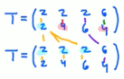
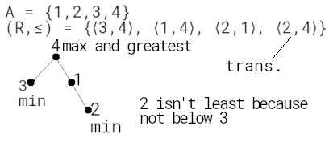
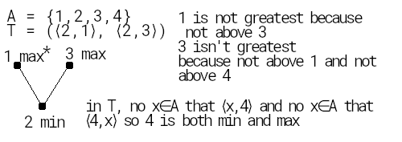

#### 𝑹: {⟨x,y⟩ for ⟨x,y⟩ ∈ A2 if x𝑹y}

#### 𝑻·𝑹: {⟨a,c⟩ | ∃b ∈ B (⟨a,b⟩ ∈ 𝑻 ∧ ⟨b,c⟩ ∈ 𝑹)}   

#### 𝑹2: a𝑹2c ⟺ {⟨a,c⟩ | ∃b ∈ A (⟨a,b⟩ ∈ 𝑹 ∧ ⟨b,c⟩ ∈ 𝑹)}  
> an ordered pair ⟨a,c⟩∈𝑹2 means there's a "middle" b∈B that satisfies ⟨a,b⟩∈𝑹 and ⟨b,c⟩∈𝑹  

  
 

_Examples_

- (a=−b)2 = 𝑰ℝ

- ⟨a,b⟩ ∈ 𝑹2 ⟺ ⟨a,c⟩,⟨c,b⟩ ∈ 𝑹  

#### Empty ∅A

> 𝑹:=rel(A×B) = ∅  
> No pair in A×B satisfies ⟨a,b⟩ ∈ 𝑹

_Properties_

- 𝑺·∅A = ∅

- anti−symmetric

- symmetric ?

_Examples_

- {⟨x,y⟩ ∈ ℕ2 | x+y﹤x}

 

#### Identity 𝑰A

_Properties_

- 𝑹·𝑰A = 𝑹

#### Reflexivity

> 𝑹:=rel(A) is reflexive if ∀a ∈ A(⟨a,a⟩ ∈ 𝑹)  
> 𝑹 is reflexive if every a in A satisfies ⟨a,a⟩∈𝑹. In other words:  
> 𝑰A ⊆ 𝑹

A = { −1, 0, 1 }. Is ⋱ contained in 𝑹?

𝑹 = lambda a,b: a⊙b; `all(R(x,x) for x in A)`?

_Properties_

- ⟺ 𝑹−1 is reflexive

- → 𝑹 ⊆ 𝑹2 (and 𝑹2 is reflexive)

- → 𝑹⊆𝑹2

- if 𝑺⊆𝑹 then 𝑺 is reflexive

- if 𝑺 is reflexive then both 𝑹∪𝑺 and 𝑹∩𝑺 are reflexive

_Examples_

- 𝑼A: ∀a ∈ A(⟨a,a⟩ ∈ A×A = 𝑼A)

- 𝑰A: ∀a ∈ A(⟨a,a⟩ ∈ {⟨−1, −1⟩, ⟨0, 0⟩, ⟨1, 1⟩})

- ≤, ≥ both contain ⋱

_Counter Examples_

- ≠ (which is 𝑼A − 𝑰A)

- <, >, ∅A

- a=−b ⋰

#### Antireflexivity

> 𝑹:=rel(A) is antireflexive iff ¬∃a ∈ A(⟨a,a⟩ ∈ 𝑹)  
> 𝑹 is antireflexive if every a in A satisfies ⟨a,a⟩ ∉ 𝑹. In other words:  
> 𝑰A ∩ 𝑹 = ∅ just 𝑰A ⊈ 𝑹 isn't enough; 𝑰A = {⟨1,1⟩, ⟨2,2⟩}⊈𝑹 = {⟨1,1⟩, ⟨1,2⟩} but ⟨1,1⟩∈𝑹 so isn't antireflexive

_Examples_

- ≠, <, >, ∅A

_Counter Examples_

- 𝑼A, 𝑰A, a=−b ⋰, ≤, ≥

#### Symmetry

> 𝑹:=rel(A) is symmetric iff 𝑹 = 𝑹−1  
> 𝑹 is symmetric if every ⟨x,y⟩ in 𝑹 satisfies ⟨y,x⟩ ∈ 𝑹  
> ∀x∀y(⟨x,y⟩∈𝑹 → ⟨y,x⟩∈𝑹)  
> 𝑹 = lambda a,b: a⊙b; `all(rel(y,x) for x,y in R)`?

_Properties_

- if 𝑺 is symmetric then both 𝑹∪𝑺 and 𝑹∩𝑺 are reflexive

- if 𝑺 is symmetric then 𝑹𝑺 is symmetric

_Examples_

- ∅A can't point at ⟨x,y⟩ and say ⟨y,x⟩ is not in ∅−1

- 𝑼A, 𝑰A, a=−b ⋰, ≠

_Counter Examples_

- ≤, ≥, <, >

#### Antisymmetry

> 𝑹:=rel(A) is antisymmetric iff 𝑹 ∩ 𝑹−1 = ∅  𝑹 ∩ 𝑹−1 = ∅ means there can't be a ⟨x,x⟩  
> 𝑹 is antisymmetric if every ⟨x,y⟩ in 𝑹 satisfies ⟨y,x⟩ ∉ 𝑹  
> ∀x∀y((x,y) ∈ 𝑹 → (y,x) ∉ 𝑹)

_Properties_

- → 𝑹 is antireflexive

- → 𝑹−1 is antisymmetric

- if 𝑺⊆𝑹 then 𝑺 is antisymmetric

- if 𝑺∪𝑻 is antisymmetric then both 𝑺 and 𝑻 are antisymmetric

- → 𝑹∩𝑺 is antisymmetric

- [if 𝑹 is antireflexive and transitive then it's asymmetric and antisymmetric](https://proofwiki.org/wiki/Antireflexive_and_Transitive_Relation_is_Asymmetric)

- No set is a ⊂ of itself, so ⊂ is antisymmetric lesson 7 00:27:40

_Examples_

- <, >, ∅A

- b﹥a2

_Counter Examples_

- ≠, ≤, ≥, 𝑼A, 𝑰A, a=−b ⋰, ≠

- b﹤a2 ⟨3,4⟩ and ⟨4,3⟩ are symmetric

#### Weak Antisymmetry

> 𝑹 ∩ 𝑹−1 ⊆ 𝑰A  
> ∀x∀y(⟨x,y⟩ ∈ 𝑹 ∧ ⟨y,x⟩ ∈ 𝑹 → x=y)  
> if both ⟨x,y⟩ ∈ 𝑹 and ⟨y,x⟩ ∈ 𝑹 it's only because they're equal  
> for x,y ∈ A: if x≠y and ⟨x,y⟩ ∈ 𝑹 then must ⟨y,x⟩ ∉ 𝑹

AS vs WAS: AS requires every pair's opposite to not be in 𝑹, whereas WAS requires the same only for pairs that x=y

_Examples_

- 𝑰A

#### Transitivity

> 𝑹2 ⊆ 𝑹  
> ∀x∀y∀z((𝑹(x,y) ∧ 𝑹(y,z)) → 𝑹(x,z))  
> Every (x,y,z)∈A that satisfy ⟨x,y⟩∈𝑹 and ⟨y,z⟩∈𝑹 also satisfy ⟨x,z⟩∈𝑹  
> If you see an x that leads to y that leads to z, then expect x to lead to z this is why 𝑹2 ⊆ 𝑹

_Properties_

- if 𝑻 is symmetric and antisymmetric then it's also transitive

_Examples_

- A={1,2,3}; 𝑹 = {⟨__1__,2⟩, ⟨2,__3__⟩, __⟨1,3⟩__} ⟹ 𝑹2 = {⟨1,3⟩} ⊆ 𝑹

- A={1,2,3}; 𝑻 = {⟨1,2⟩} ⟹ 𝑻2 = ∅ ⊆ 𝑻

- 𝑾 = {⟨1,1⟩} ⟹ 𝑾2 = {⟨1,1⟩} ⊆ 𝑾

- 𝑰A

- ∅A

- 𝑼A if ⟨a,b⟩ ∈ A2 and ⟨b,a⟩ ∈ A2 then ⟨a,c⟩ ∈ A2

- if |A|﹥1 then ≠ is trans

- <, ≤

- 𝑻 = (⟨2,1⟩, ⟨2,3⟩) ⟹ 𝑻2 = ∅⊆𝑻

 

_Counter Examples_

- 𝑷={⟨1,2⟩, ⟨2,1⟩} ⇒ 𝑷2 = {⟨1,1⟩, ⟨2,2⟩} ⊈ 𝑷 iow: 1 leads to 2 leads to 1, but ⟨1,1⟩ ⊈ 𝑷

- ∃x∃y∃z(𝑹(x,y) ∧ 𝑹(y,z) ∧ ¬𝑹(x,z))

------

#### Equivalance

> 𝑹 over A is equivalence iff 𝑹 is reflexive, symmetric and transitive

_Examples_

- 𝑼A, 𝑰A, equality

- "Has the same absolute value" on the set of real numbers

- if A=∅ then ∅A is symmetric, transitive and reflexive

_Counter Examples_

- ≥ reflexive and transitive but not symmetric

- if A≠∅ then ∅A is symmetric and transitive, but not reflexive

#### Connexivity

lesson 7 00:06:00

> 𝑹 over A is connexive iff ∀(x,y)∈A (x≠y → ⟨x,y⟩∈𝑹 ⋁ ⟨y,x⟩∈𝑹)

_Examples_

- Any two numbers ℕ

---

### Order (יחסי סדר)

---

lesson 7 00:00:00

 

#### Partial Order (יחס סדר חלקי)

> 𝑹 over A (≤) is a partial order iff it's [antireflexive](#antireflexivity) and [transitive](#transitivity)

_Properties_

- [Antisymmetric](#antisymmetry) because antireflexive and transitive

- set A with partial order is a קבוצה סדורה חלקית

_Examples_

- ⊂ over 𝓟(ℕ) A∈𝓟(ℕ) is antisym because A⊄A, and trans because A⊂B⊂C ⇒ A⊂C

???  
for all a, b, and c:  
- a ≤ a reflex  
- if a ≤ b and b ≤ a, then a = b antisymm  
- if a ≤ b and b ≤ c, then a ≤ c trans  

_Examples_

- equality  
???

#### Total Order (יחס סדר מלא)

> Partial order and [connexive](#connexivity) (aka "linearly ordered")  
> ∀(x,y)∈A (x≠y → ⟨x,y⟩∈𝑹 ⊻ ⟨y,x⟩∈𝑹) note the xor. verify

_Properties_

- set A with total order is a קבוצה סדורה לינארית

_Examples_

- < over ℕ also over ℝ?

_Counter Examples_

- if A≠∅ then 𝑰A isn't total order because for all a∈A: a=a

 

### Minimal / Maximal Element (איבר מינימלי / מקסימלי)

> Element a in partially ordered set A is a minimal element if there's no other element x∈A that x≺a  
> (𝑷, ≤) is partially ordered set ⟹

> - { y∈𝑷 | ∀x∈𝑷, y≤x} → y is least element x is all the elements in 𝑷  
> - { y∈𝑷 | ∀x∈𝑷, x≤y} → y is greatest element

lesson 7 00:36:00

_Properties_

- a partially ordered, __finite__ set has at least one min element and one max element p. 110

- a partially ordered, __infinite__ set __may__ have min / max elements

_Examples_

---

### Partitions

---

#### Partition of A is a set of non-empty, non-overlapping subsets of A whose ∪ = A

_Properties_

- every a∈A is in exactly one block

- no block contains ∅

- ∪ of blocks = A

- intersection of any two blocks = ∅

- → A is finite ⇒ rank of P is |X| − |P| ?

_Examples_

- {A} is partition of A trivial

- ∅'s only partition is ∅

- {1,2,3} has five partitions: {{1},{2},{3}}, {{1, 2}, {3}}, {{1, 3},{2}}, {{1},{2, 3}}, {{1, 2, 3}}

_Counter Examples_

- not partitions of {1,2,3}: 

  - {{}, {1,3}, {2}} contains ∅

  - {{1, 2}, {2, 3}} 2 exists in more than one block

  - {{1}, {2}} no block contains 3

---

#### Equivalence Class: {x∈𝑺 | x≡a} where a∈𝑺

> Given 𝑹 is an equivalence relation on 𝑺, the equivalence class of an element a in 𝑺 is the set {x∈𝑺 | ⟨x,a⟩∈𝑹}  
> a = {b|a𝑹b} = {b|⟨a,b⟩ ∈ 𝑹} all elements in 𝑺 that when paired with a, exist in 𝑹  
> In other words: going over 𝑹, the elements in a are all the elements that a is paired with

_Properties_

- ⋃ of all equivalence classes = 𝑺 ?

- a ∈ a every element exists in its equivalence class

- the items in each equivalence class of 𝑺 exist only in their equivalence class ?

- every possible pair of eq. classes is zar ? 

_Examples_

- 𝑿 = all cars; relation ≡𝑿 = "has the same color as"; one particular equivlance class consists of all green cars

- Relation ≡ℤ is ⟨a,b⟩∈≡ℤ ⟺ (a − b)%2==0 ⟹ two equivalence classes: even numbers and odd numbers

- 𝑺 = {1,2,3,4,5}

  - ≡𝑺 = {⟨1,__1__⟩, ⟨1,__2__⟩, ⟨1,__3__⟩, ⟨2,2⟩, ⟨3,3⟩, ⟨4,4⟩, ⟨5,5⟩, ⟨2,1⟩, ⟨2,3⟩, ⟨3,2⟩, ⟨3,1⟩}  
  - 1 = __{1, 2, 3}__ everything that 1 is related to

  - 2 = {2, 1, 3}

  - 3 = {3, 2, 1} note that 1 ≡ 2 ≡ 3

  - 4 = {4}

  - 5 = {5}